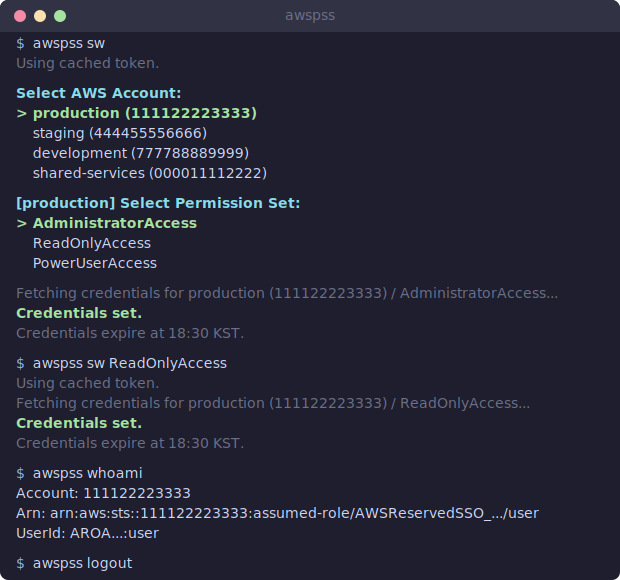

# awspss

AWS Identity Center Permission Sets Switcher

[한국어](docs/README.ko.md)

Interactively select an AWS Account and Permission Set after SSO login, and the temporary credentials are automatically set in your current shell.

<p align="center">
  
</p>

## Installation

### pip / pipx

```bash
pip install awspss

# or pipx (isolated environment)
pipx install awspss
```

### Homebrew

```bash
brew tap boseung-code/tap
brew install awspss
```

### From source

```bash
git clone https://github.com/boseung-code/awspss.git
cd awspss
pip install -e .
```

## Setup

### 1. Register shell function

Shell function registration is required for `awspss login` and `awspss sw` to set credentials directly in your current shell.

```bash
eval "$(awspss init)"
```

This will:
1. Detect your shell rc file (`.bashrc` or `.zshrc`)
2. Ask for confirmation
3. Register to rc file + activate immediately in current shell

Duplicate registration is prevented. New terminals will activate automatically.

To register manually, add to your `.bashrc` or `.zshrc`:

```bash
eval "$(awspss init --print)"
```

### 2. Configure SSO connection

```bash
awspss configure
```

Prompts for start-url and region interactively. You can also pass them directly:

```bash
awspss configure --start-url https://your-org.awsapps.com/start --region ap-northeast-2
```

## Usage

### Login

```bash
awspss login
```

Always performs a fresh SSO authentication via browser. After authentication, select Account → Permission Set and credentials are set in your current shell.

### Switch credentials

```bash
awspss sw
```

Switch to a different Account/Permission Set using cached token (no re-login). Automatically re-authenticates if the token has expired.

### Without shell function (eval)

```bash
eval $(awspss login)
eval $(awspss sw)
```

### Verify credentials

```bash
aws sts get-caller-identity
aws s3 ls
terraform plan
```

### Clear credentials

```bash
unset AWS_ACCESS_KEY_ID AWS_SECRET_ACCESS_KEY AWS_SESSION_TOKEN
```

## Commands

| Command | Description |
|---|---|
| `awspss init` | Register shell function (auto-add to rc file + activate) |
| `awspss init --print` | Print shell function only (for manual setup) |
| `awspss configure` | Configure SSO connection |
| `awspss login` | SSO login (always re-authenticates) |
| `awspss sw` | Switch account/permission set (uses cached token) |
